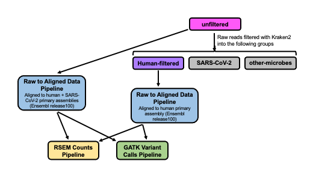
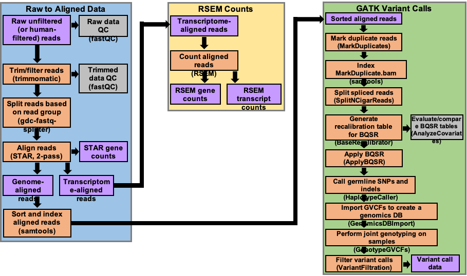

# Processing pipeline for Illumina RNA-sequencing data

The COV-IRT workflow for processing Illumina RNA-sequencing data from COVID-19 samples begins with unfiltered raw fastq files, which are subsequentently filtered with Kraken2 into 3 groups: one consisting of human reads, another with SARS-CoV-2 reads, and a third containing reads from other microbes. The unfiltered reads and the human filtered reads are processed through three pipelines: [Raw to Aligned Data](), [RSEM Counts](), and [GATK Variant Calls](), to generate alignment, count, and variant call data, respectively, for each sample within each cohort of data. Exact processing scripts used for each cohort are provided in the [Exact_scripts_used](Exact_scripts_used) sub-directory. 

---

## RNAseq Workflow 

---

## RNAseq Pipelines Overview 

